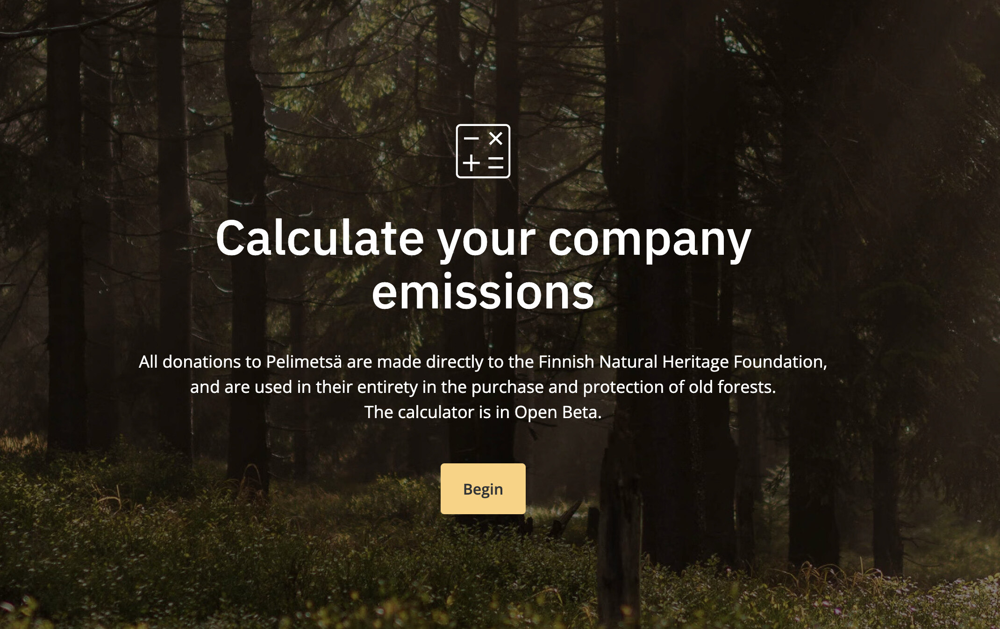

# Pelimetsä Calculator

[](https://pelimetsa.fi/)

[Pelimetsä](https://pelimetsa.fi/) is a project of the Finnish game developer community for the protection of old Finnish forests. The trees and the forest floor are a permanent storage for carbon, and a haven of vulnerable biodiversity.

## How to use the calculator

Clone or fork the repo or add the calculator fuction, helpers and types directly to your project.

```script
git clone https://github.com/bou-co/pelimetsa-calculator-public.git
```

```ts
import { calculateEmissions, EmissionResults, EmissionData } from 'calculator';

const results: EmissionResults = calculateEmissions(data: EmissionData);
```

At the [Pelimetsä-website](https://pelimetsa.fi/) you can see one implementation for the calculateEmissions function. We gather the data for the calculator from a multi-step form and use the return values to display the carbon emissions relative to the total area of old growth forest that the Finnish Heritage Foundation could protect with a donation that matches these emissions.

[](https://pelimetsa.fi/)

### Example input values for calculateEmissions function

```json
players: [
  {
    platformType: "pc",
    gameType: "multiPlayer",
    dailyActiveUsers: 6000
  },
  {
    platformType: "pc",
    gameType: "singlePlayer",
    purchasedGamesAmount: 60000,
    averigePlayTime: 20
  },
  {
    platformType: "console",
    gameType: "multiPlayer",
    calculateEmissionsdailyActiveUsers: 6000

  },
  {
    platformType: "console",
    gameType: "singlePlayer",
    purchasedGamesAmount: 60000,
    averigePlayTime: 20
  },
  {
    platformType: "mobile",
    dailyActiveUsers: 6000,
    sessionLength: 15
  }
],
personnel: 33,
travel: 29,
other: 10,
```

### Example return values for calculateEmissions function

```json
donationSumInEuros: 31500,
emissionPercentages: {
  other: 2.2180976168917637,
  personnel: 5.23271408800936,
  players: 90.41731130128657,
  travel: 2.1318769938123006
},
protectedForestAreaInHectares: 6.3
totalCarbonEmissionsPerYear: 450
```
